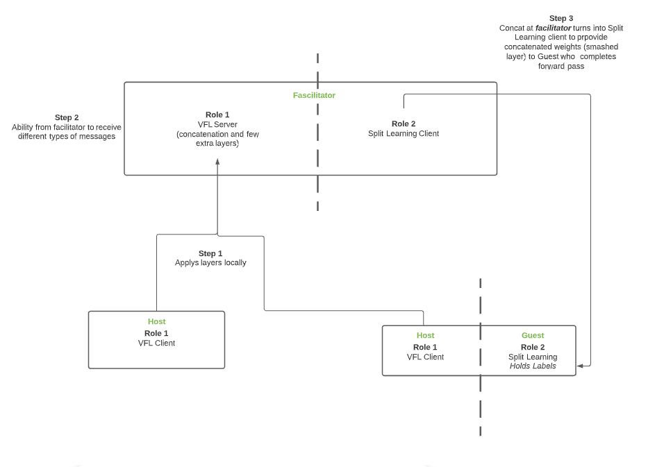

# FedML: Implementation of the facilitator architecture based on the loan data set
This serves as a simulation for a deviation of split learning. In this scenario a facilitator receives the activations from the clients and performs forward propagation. The results from the facilitator are then passed on to the Guest holding the ground truth. For more detail refer to the architecture diagram.
### Architecture


### Running the code
1. Run ```sh CI-install.sh``` (Update line 24 depending on physical machine requirement) 
2. Download the dataset "loan.csv" (download link: https://github.com/harrinac/lending_club_analysis/blob/master/LendingClub_17_18_excerpt.csv.gz) file into this directory:

    ```FedML/data/lending_club_loan/ ```
3. Run: 
   
   ```python3 fedml_experiments/standalone/classical_vertical_fl/run_vfl_fc_two_party_lending_club_facilitator.py```

